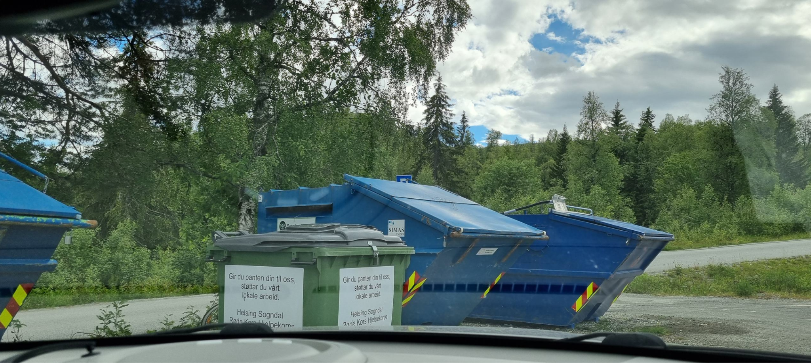

# Welcome to Køyribu

## House Rules
- Quiet between 23:00 and 07:00  
- No pets allowed  
- No smoking inside  

---

## Access Code for Front Door
The code is sent via Airbnb. The keypad is next to the front door. Please lock the door when leaving.

Open: Enter code + 

Lock: Press 

---

## WiFi
- **Network**: `koyribu-gjest`  
- **Password**: See info bookelet inside cabin

---

## Lights
The cabin has smart lighting which you can control through light switches that all support dimming.

In the hallway, by the entrance door, there is a light switch with two buttons, the top row switches lights on/off in the hallway, the bottom row all lights in the entire cabin.

There are two categories of light switches. If the switch does not work on the first press, then press a second time. (We can control lights from different switches, so if lights are turned off in a different way than the current switch, you have to press 2 times).

### Light Switch Types:
- **Multiple Lights**:
  - On: press `1`, Off: press `0`  
  - Dimming: Hold `1` to dim up, `0` to dim down
    

- **Single Light**:
  - On/Off: press left power button  
  - Dimming: Hold the "sun" button (dims opposite of previous)

---

## Heating
There is heating in the floor of the hallway, living room, kitchen and bathroom in addition to the bathroom upstairs. This is control of the washroom, but do not adjust the control panel here. It takes time for the heat to change since it is waterborne.
If it is too cold, notify the home owner. If it's too hot, try to air it out and close the doors to the bedroom. It is also possible to adjust the heat up and down on black thermostats with a display that you find on the walls of the first floor hallway, living room or bathrooms.

---

## Drinking Water
In Norway you can normally drink tap water, but there have been problems with the well that are not completely fixed yet. We have drunk the water ourselves without problems throughout the winter, but as a guest we want to inform you about this so that you can choose for yourself. The tap water is just fine for cooking, showering, brushing teeth, washing up and likewise.

We have provided a 5L can in the refrigerator for drinking water that can be refilled from 20L containers outside (behind the cabin in the shadow). Please do not remove the cans/containers from the cabin when you leave.

---

## Kitchen Guide
In the base cabinet, there are two visible drawers, but inside the top one is a hidden extra white drawer at the top.
Wine/beer glasses are in the kitchen cabinet behind the bar stool closest to the hallway.

### Oven
- Power: Leftmost button  
- Select program → Press "Start" (Program: Scroll up and down by turning the dial to the right)

### Dishwasher
- Power on → Select program (default ~3 hours) → Press "Start" (pink array)  
- Tablets are under the sink
- When the machine is running it will display a light on the floor
- Open door when finished for faster drying  

### Ventilator
- Outer button = light  
- Inner button = on/off  
- Middle buttons = fan speed  

### Cooktop  
Use the power button to turn it on, select a burner, and use the slider to choose the level. If the stove safety feature is activated, you need to turn off the cooktop, wipe up any spills, and then press the stove guard on the wall above the cooktop.

---

## Freezer
Located in the stairwell. Plug it in if you want to use it.

---

## TV & Entertainment
- **Strim**, **Netflix**, **HBO** etc. installed  
- Log in with your own accounts (remember to log out before leaving)  
- Use **Sonos app** or Bluetooth speakers for audio  

---

## Bathroom
Turn on the fan when you shower, the button is by the entrance door.

---

## Sauna
The switch on the right turns on the sauna. The white/clear section controls the number of hours, and the black section controls the delayed start time. The switch on the left controls the temperature. When it is set at the red mark, it is approximately 75 degrees celsius.

---

## Trash
Trash is collected in shared containers down at the Hodlekve ski center, at the last parking lot. Here, paper/cardboard, glass/metal are sorted, while the rest goes in the general waste. It is also possible to donate bottle deposits to the Red Cross in a separate bin.

Trash containers are located at the pink square on the map below. The cabin is marked with a red marker.

---

## Upstairs Living Room
The coffee table in the living room can be opened in the middle; lift it to the side. There are many games inside. 🎲

---

## Electric Car Charging
Chargers are available at **Dalalåven Café/ski center** (~500 m walk).  

More info: [sogndalskisenter.no → EV Charging](https://en.sogndalskisenter.no/aktuelt/elbil-lading-i-rindabotn)

There are high power chargers in Sogndal.

---

## Departure Checklist
- Start dishwasher if needed (Otherwise: All kitchen utensils, tableware, etc., must be washed and put in place.)
- Put towels in bathroom  
- Turn off bathroom fan  
- Close all windows  
- Lock balcony, laundry room (from inside), and main door
- We would also appreciate it if you take off the bed linen and leave it in the laundry room.
- Please report any damage to the owners

---

## Contact (Problems or Questions?)
- **Randi Øyri**: +47 41518358  
- **Espen Kørra**: +47 92808669  
- Or contact via Airbnb messages

---

**Enjoy your stay at our family cabin! 🌲🏡**
