# Guest Information

This page collects the practical information you may need before and during your stay at Koyribu.

[Back to the cabin page](cabin)

---

## House Rules

- Quiet hours between 23:00 and 07:00
- No pets allowed
- No smoking inside

---

## Arrival and Access

The door code is sent through Airbnb. The keypad is next to the front door. Please lock the door whenever you leave the cabin.

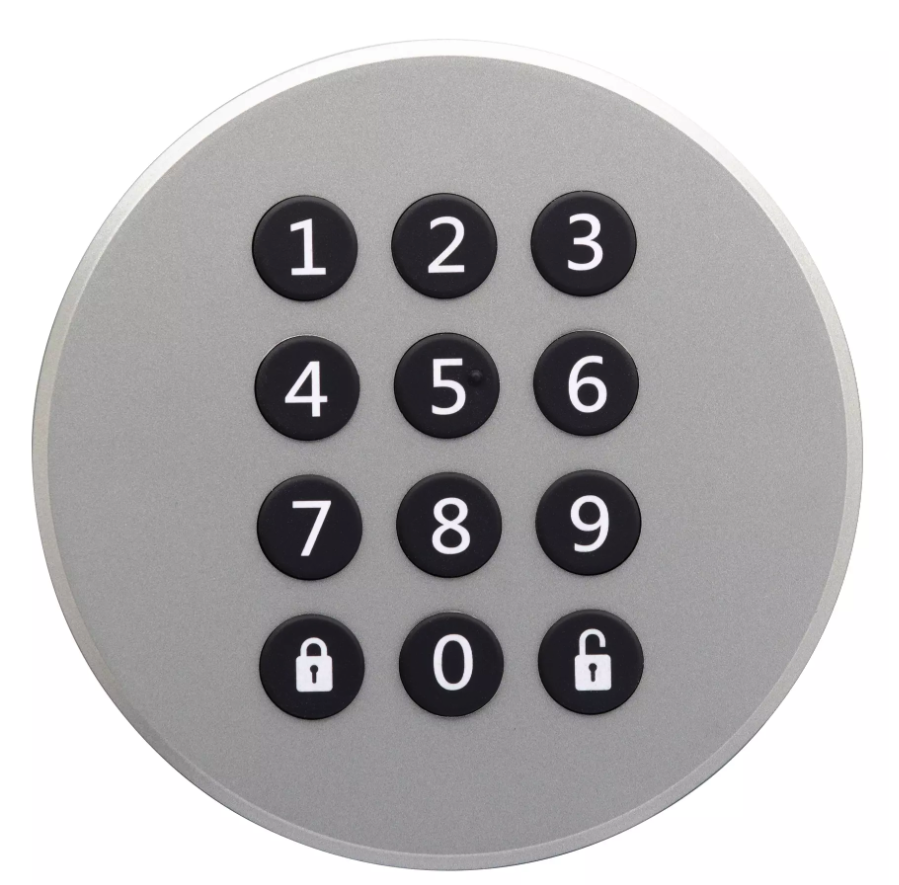

Open: enter your code, then press the open button.

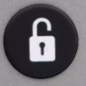

Lock: press the lock button when leaving.

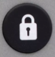

---

## WiFi

- Network: `koyribu-gjest`
- Password: see the information booklet inside the cabin

---

## Lights

The cabin has smart lighting with dimmable wall switches. In the hallway by the entrance, the upper row controls the hallway lights and the lower row controls much of the cabin lighting.

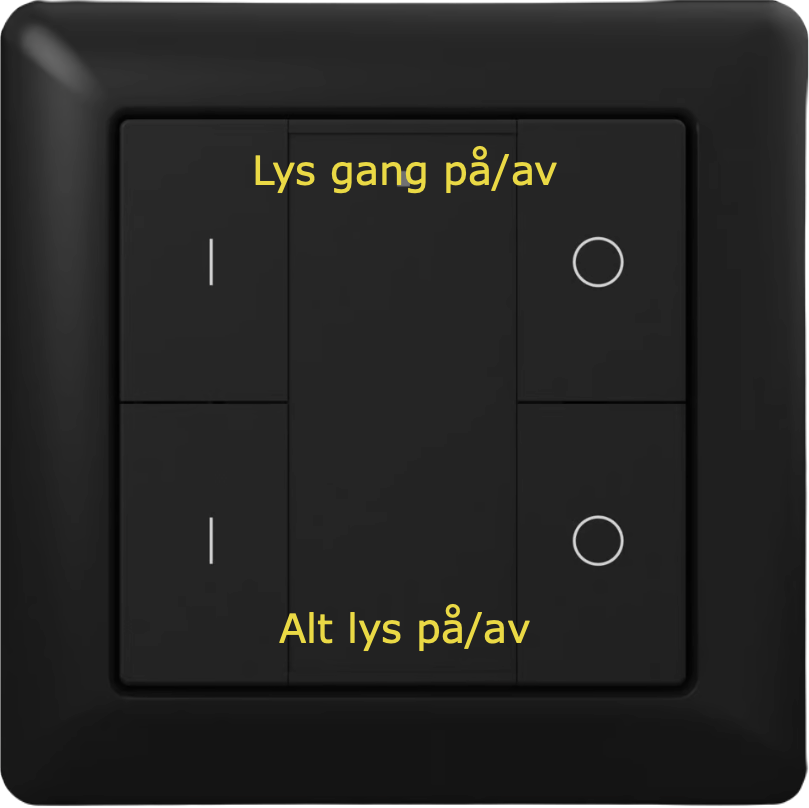

Some switches control the same lights from different places. If nothing happens on the first press, press once more.

### Multi-light switch

- Press `1` to turn lights on
- Press `0` to turn lights off
- Hold `1` to dim up
- Hold `0` to dim down

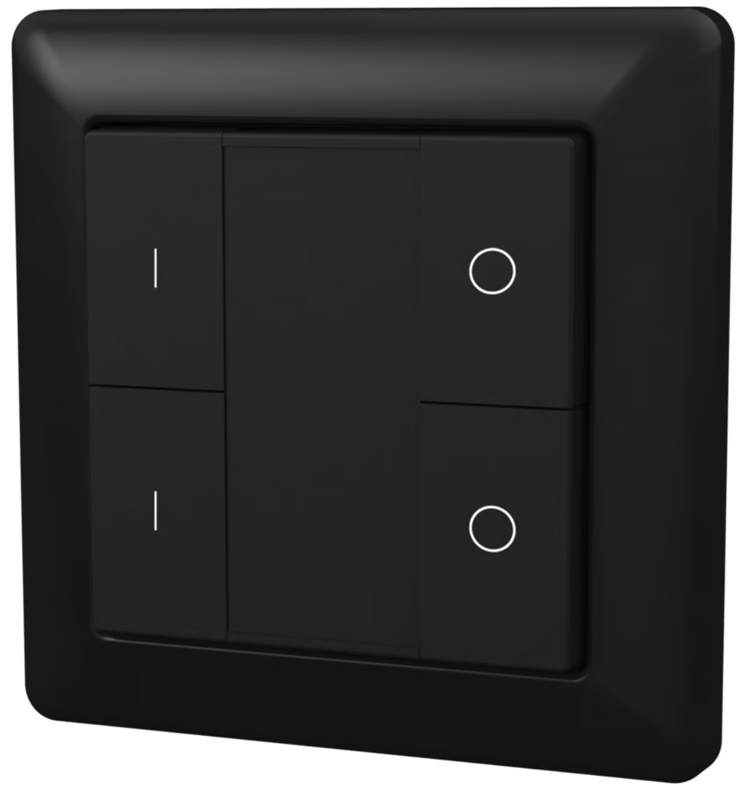

### Single-light switch

- Use the left power button to turn the light on or off
- Hold the sun button to dim

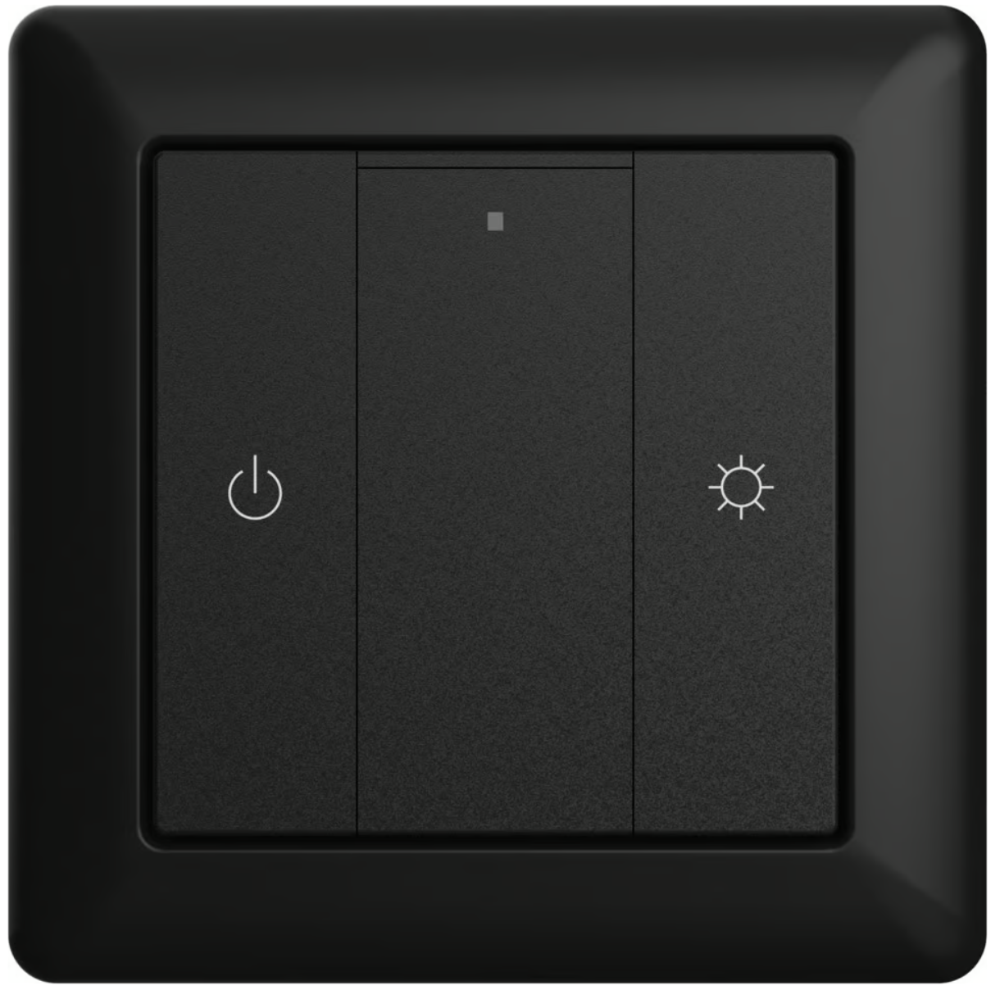

---

## Heating

There is underfloor heating in the hallway, living room, kitchen, and bathrooms. The system reacts slowly because it is water-based.

- If it feels too cold, please contact the owners
- If it feels too warm, air out the room and close bedroom doors if needed
- Some rooms also have black wall thermostats with displays for small adjustments

Please do not adjust the main heating control panel.

---

## Drinking Water

Tap water can normally be used for cooking, showering, brushing teeth, and washing up. We want to mention that there have previously been issues with the well, so we provide separate drinking water for guests.

A 5-litre container is kept in the refrigerator and can be refilled from the 20-litre containers stored outside behind the cabin in the shade. Please leave all containers at the cabin when you depart.

---

## Kitchen

The kitchen is fully equipped for everyday cooking. There are two visible drawers in the base cabinet, and an extra hidden white drawer inside the upper one. Wine and beer glasses are stored in the cabinet behind the bar stool closest to the hallway.

### Oven

- Turn it on with the left button
- Select a program
- Press `Start`

### Dishwasher

- Turn it on
- Select a program
- Press `Start`
- Tablets are stored under the sink
- A light on the floor shows that the machine is running
- Open the door after the cycle for faster drying

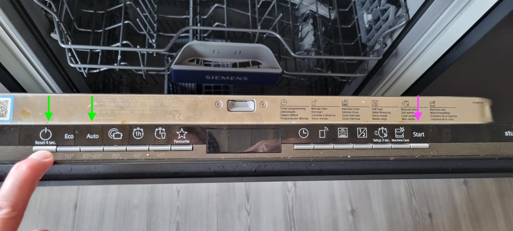

### Ventilator

- Outer button: light
- Inner button: on or off
- Middle buttons: fan speed

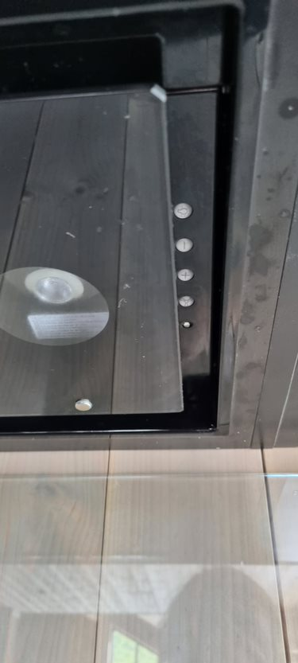

### Cooktop

Use the power button to switch it on, select a cooking zone, and use the slider to set the level. If the stove safety feature is activated, turn the cooktop off, wipe up any spills, and press the stove guard on the wall above the cooktop.

### Freezer

The freezer is located in the stairwell. Plug it in if you want to use it.

---

## TV and Entertainment

- Streaming services such as Strim, Netflix, and HBO are available
- Please use your own accounts and remember to log out before leaving
- For audio, use the Sonos app or Bluetooth speakers

---

## Bathroom

Please turn on the fan when showering. The button is placed by the bathroom entrance door.

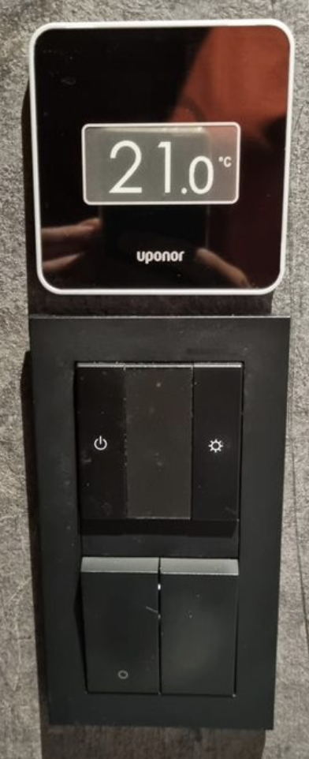

---

## Sauna

The switch on the right turns on the sauna. The white or clear section sets the number of hours, and the black section controls delayed start. The switch on the left controls temperature. At the red mark, the sauna is about 75 degrees Celsius.

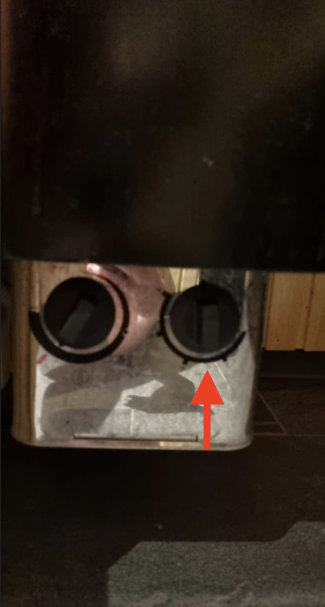

---

## Waste and Recycling

Waste is collected in shared bins at Hodlekve ski center, near the last parking area. Paper and cardboard, glass and metal are sorted separately, while the rest goes in general waste. Bottle deposits can also be donated to the Red Cross there.

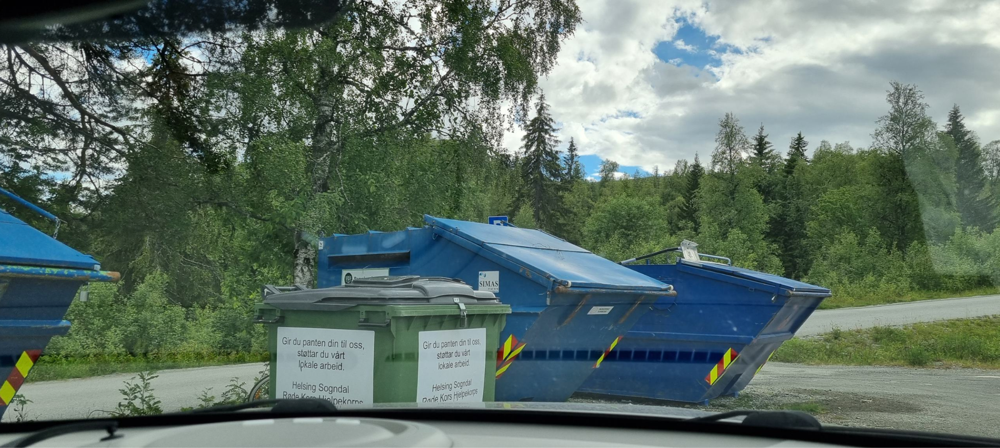

The map below shows the bin location. The cabin is marked with a red marker.

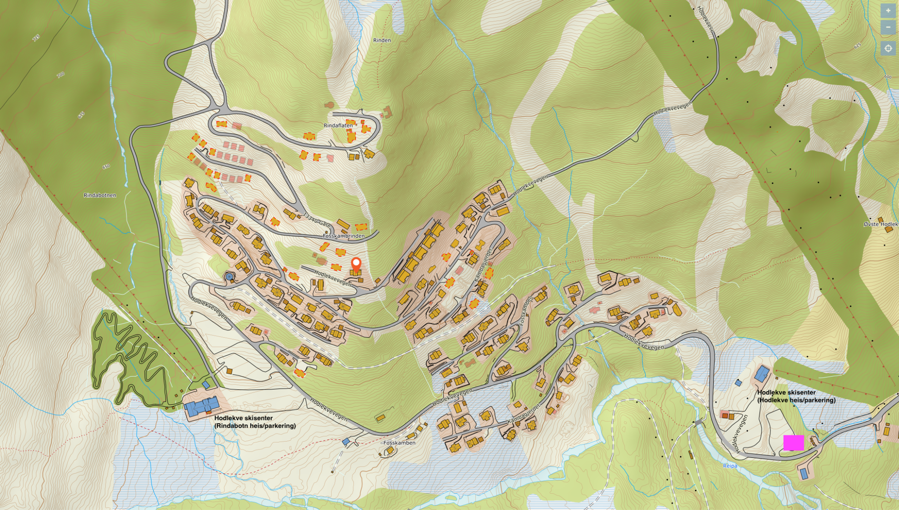

---

## Upstairs Living Room

The coffee table in the upstairs living room opens in the middle. Lift it carefully to the side. There are games stored inside.

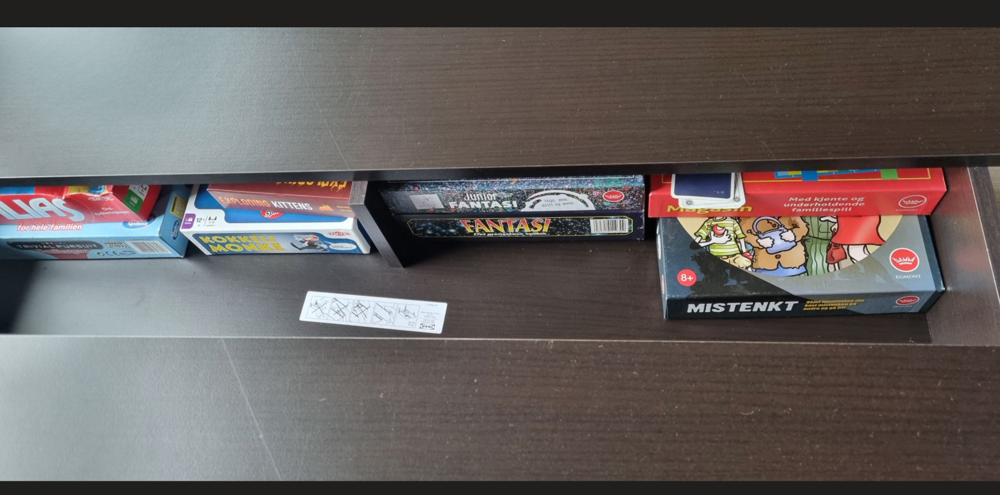

---

## Electric Car Charging

Chargers are available at Dalalaven Cafe and ski center, around 500 metres from the cabin.

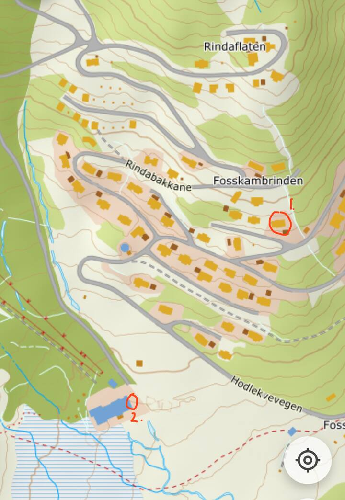

More information: [EV charging in Hodlekve](https://en.sogndalskisenter.no/aktuelt/elbil-lading-i-rindabotn)

There are also high-power chargers in Sogndal.

---

## Before You Leave

- Start the dishwasher if needed
- Otherwise, wash and put away all kitchen utensils and tableware
- Place used towels in the bathroom
- Turn off the bathroom fan
- Close all windows
- Lock the balcony door, the laundry room from the inside, and the main door
- We appreciate it if you remove bed linen and leave it in the laundry room
- Please report any damage to the owners

---

## Contact

- Randi Oyri: +47 41518358
- Espen Korra: +47 92808669
- Or contact us through Airbnb messages

---

Enjoy your stay at our family cabin.
