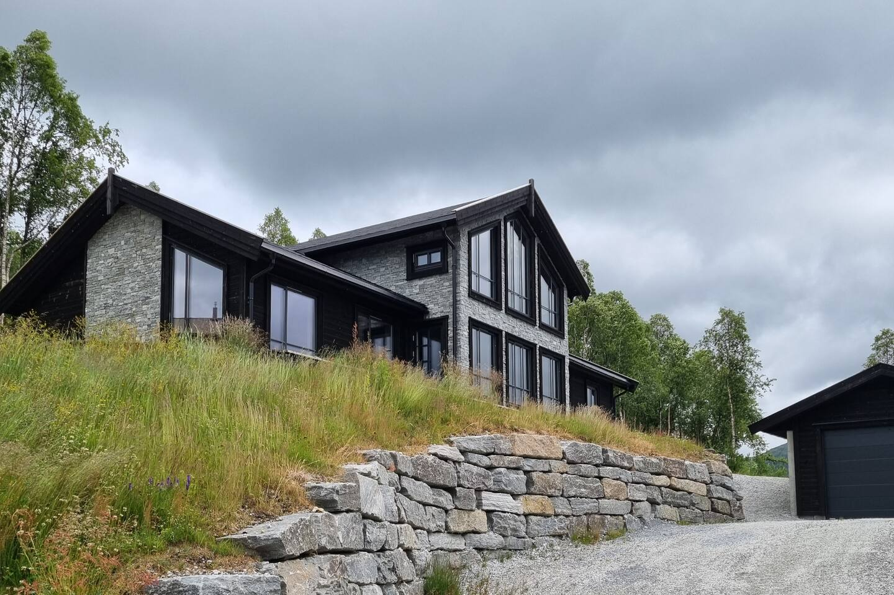
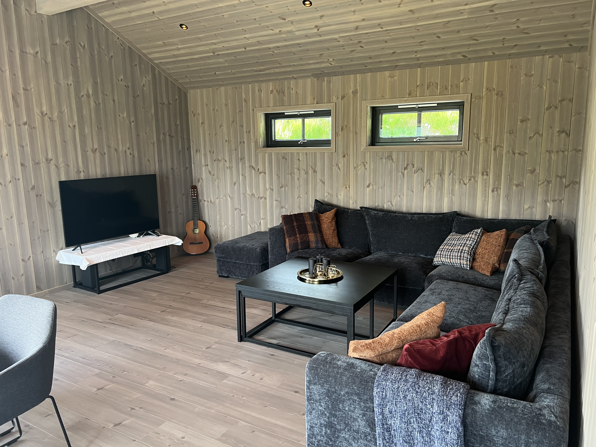

# Welcome to **Koyribu**

A spacious and comfortable cabin surrounded by beautiful nature – perfect for relaxation, family getaways, or focused work in peaceful surroundings.

---

## 🏡 About the Cabin
- **Type**: Generous mountain cabin with open plan and modern facilities  
- **Bedrooms**: 4 bedrooms with multiple sleeping spaces  
- **Bathrooms**: Two bathrooms with showers and toilets  
- **Amenities**: Wifi, fully equipped kitchen, cookware, bedding, and towels. We will put on beddings for number of guests ordered for.

Koyribu offers you the space to unwind or work in quiet and inspiring natural surroundings – all year round.

---

## 📸 Gallery

   
  
  
  

---

## 🌲 Surroundings & Activities
- Amazing hiking trails just outside the door  
- Swimming and fishing in nearby lakes  
- Quiet, secluded location – ideal for unwinding  

---

## 📅 Availability
 👉 [Check availability and book on Airbnb](https://www.airbnb.com/rooms/902164708584277005)  
**Guests**: Suitable for couples, families, or small groups  

---

## 💬 About the Hosts
We want to offer you a warm and spacious cabin experience in beautiful nature. Koyribu is perfect for a quiet break or longer stays. During winter, we often use the cabin ourselves as an active family who enjoys skiing and alpine adventures.

---

© 2025 Koyribu koyribu.no  
Published via GitHub Pages
