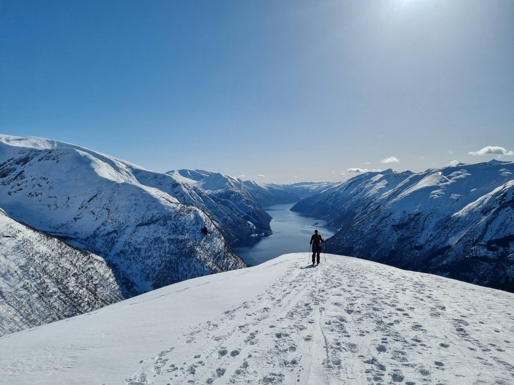
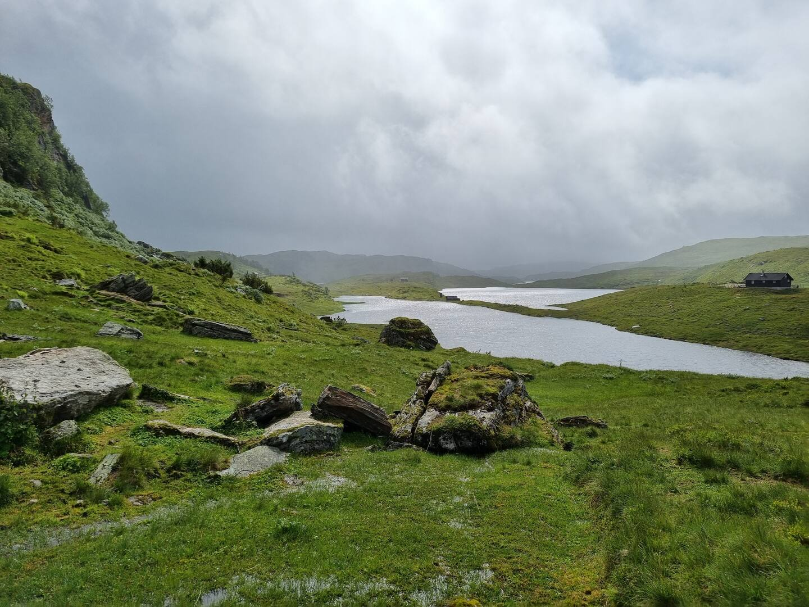
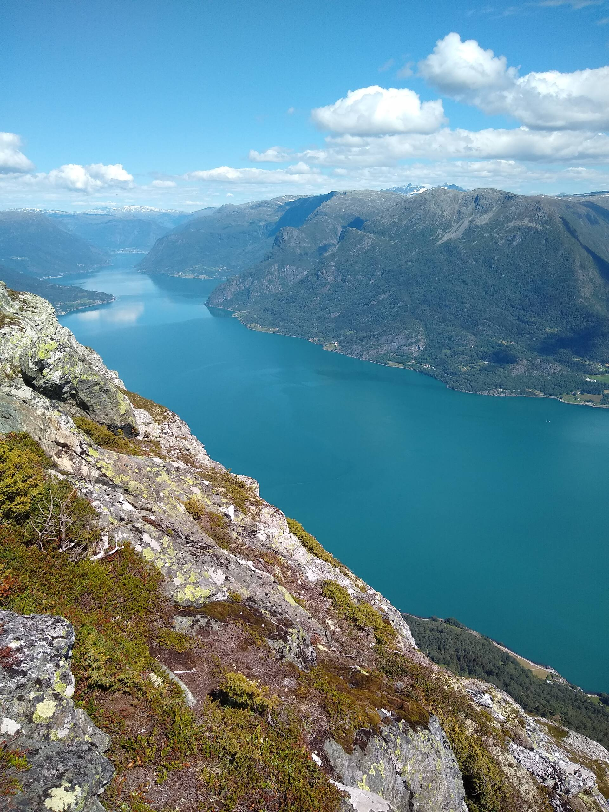

# 🏔️ Hikes Near Koyribu

The **Koyribu** cabin is perfectly located for mountain hikes in the Sogndal mountains and the Fjærland area. Here you'll find a selection of our favorite summer hikes – from scenic peaks with fjord views to easy walks through peaceful valleys.

---

## ⛰️ Skredfjellet – Fjord & Mountain Views in Fjærland

**About the hike**  
A fantastic trail if you're looking for great fjord and mountain views. The hike starts at Berge, just before Fjærland. The view from the top is stunning!

- 🚗 Drive time: ~20 min from the cabin
- ⏱️ Duration: 3–4 hours round trip
- 🥾 Difficulty: Medium
- 🔗 [More at Visit Norway](https://www.visitnorway.no/listings/fjell-og-fjord-vandring-til-skredfjellet-i-fj%C3%A6rland/246118/)

---

## ⛰️ Togga – Scenic Peak Near the Cabin

**About the hike**  
A popular and airy summit with 360° views. Steep climb through the forest – avoid this hike in wet weather. Start from the parking lot at Nystølen.

- 🚗 Drive time: 10 min from the cabin
- ⏱️ Duration: 3–4 hours round trip
- 🥾 Difficulty: Demanding
- ⚠️ Note: Steep and slippery in wet conditions
- 🔗 [Description on UT.no](https://ut.no/turforslag/116454)  
- 🔗 [Photos and inspiration](https://www.fjellvenner.no/fjellturer-i-andre-fjellomraader/togga-1205-moh)

---

## 🌿 Gunvordalen – Gentle Walk in a Peaceful Valley

**About the hike**  
Prefer a flatter, easier hike? Gunvordalen offers calm surroundings and lovely scenery. Start from the same parking lot as Togga.

- 🚗 Drive time: 10 min from the cabin
- ⏱️ Duration: 1–3 hours round trip (flexible length)
- 🥾 Difficulty: Easy
- 🔗 [Trail info – Peakbook](https://peakbook.org/no/peakbook-element/63255/Tursti+Gunvordalen.html)

---

## 🎣 Fagreggi – Family-Friendly Hike with Mountain Lake Fishing

**About the hike**  
A family-friendly hike up to the treeline, with several small lakes perfect for fishing. Usually about a 1-hour walk up.

- 🚗 Drive time: 0 – hike directly from the cabin / Sogndal Skisenter (Hodlekve)
- ⏱️ Duration: About 2 hours, can extend the hike with e.g. Reppanipa or Hellebrandseggi.
- 🥾 Difficulty: Easy  
- 🎣 Fishing: Yes – many small lakes with trout. Remember to buy a fishing permit. Can buy with Vipps #699351 30 NOK a day, free for children under 16 years old.
- Map: https://www.norgeskart.no/#!?project=norgeskart&layers=1001&zoom=13&lat=6819263.65&lon=69324.80&sok=fagreggi&markerLat=6819267.220029058&markerLon=69071.47161072219&p=searchOptionsPanel
- 🔗 [Visit Norway link](https://www.visitnorway.no/listings/g%C3%A5tur-til-fagreggi/261753)

---

## 🐐 Anestølen – Family Farm Visit with Goats and Fishing

**About the hike**  
The perfect family outing: walk through the valley, meet 400–600 goats grazing freely, and enjoy fishing or swimming in the Anestøl Lake.

- 🚗 Drive time: ~10 min from the cabin (via toll road from Sogndal Skisenter/Hodlekve)
- ⏱️ Duration: 0 if driving in; 1–2 hours round trip if walking the gravel road
- 🥾 Difficulty: Easy
- 🎣 Fishing: Yes – along the lake, great for a quick swim too
- 💶 Price: toll road ~NOK 50 per car
- 🔗 [Anestølen bike tour – Fjord Norway](https://www.fjordnorway.com/no/se-og-gjore/sykkeltur-til-anestolen)
- 🔗 [Guided visit and farm info](https://www.visitnorway.no/listings/guida-st%C3%B8lsbes%C3%B8k-anest%C3%B8len-sogndal/245705/)

---

## 🏞️ Molden – Classic Fjord View Hike

**About the hike**  
One of the region’s most popular hikes. Spectacular views over Lustrafjord. Start from Krossen.

- 🚗 Drive time: ~30 min from the cabin
- ⏱️ Duration: 2–3 hours round trip
- 🥾 Difficulty: Medium
- 🔗 [Hike to Molden from Krossen – UT.no](https://ut.no/turforslag/118573/topptur-til-molden-fra-krossen)

---

## 🧭 Hiking Tips
- Check the weather forecast – especially for Togga and Skredfjellet
- Bring water and extra layers
- Wear sturdy shoes – some paths are steep or rocky
- Find maps and more routes at **UT.no** and **Norgeskart.no**
- Fishing permits: https://www.sogndalskisenter.no/fiske

---

Happy hiking from all of us at **Koyribu**!  
We're happy to offer local advice or even guided hikes if desired – we know the area well.
