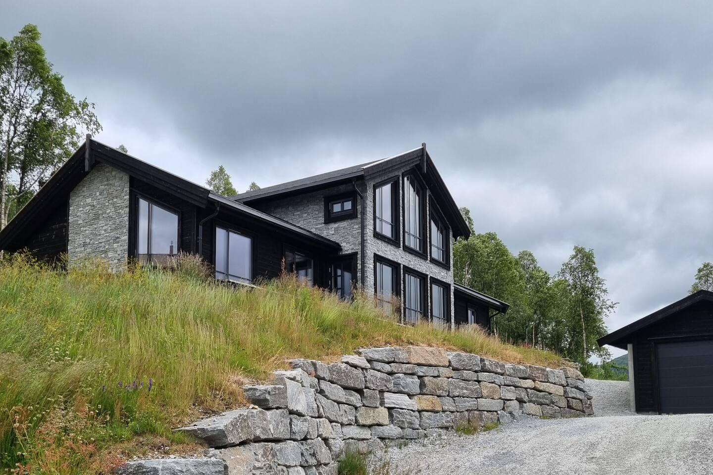
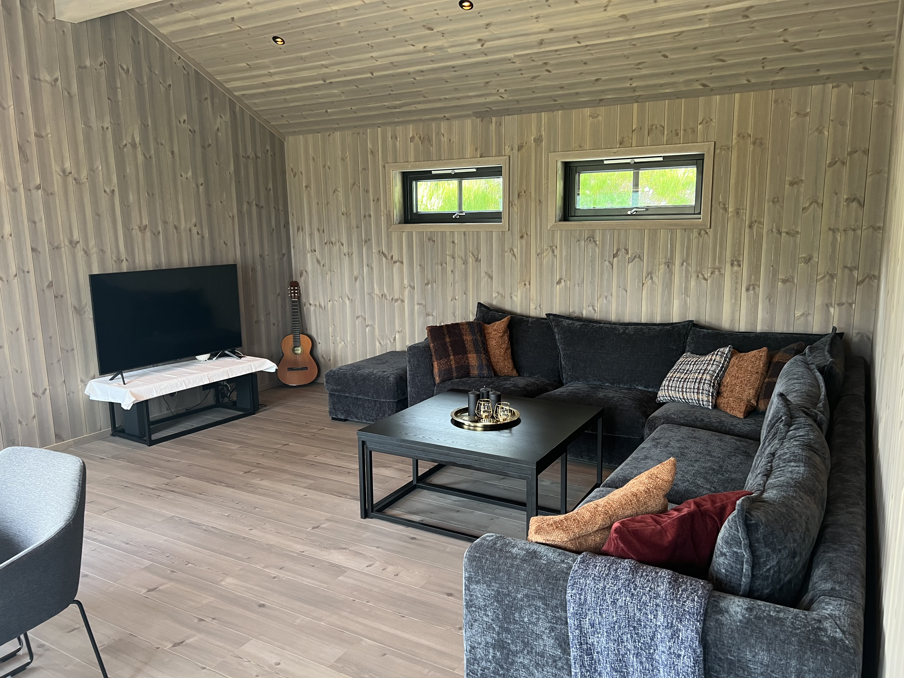

# Velkomen til **Koyribu**

Ei stor og komfortabel hytte omgitt av vakker natur – perfekt for avkopling, hytteturar med familien eller fokusert arbeid i fred og ro.

---

## 🏡 Om Hytta
- **Type**: Romslig fjellhytte med open plan og moderne fasilitetar
- **Soverom**: Fleire sengeplassar og 4 soverom
- **Bad**: To bad med dusj og toalett
- **Fasilitetar**: Wifi, vedomn, fullt kjøkken, kokekar, sengetøy og handkle

Koyribu gir deg rom både til å slappe av og til å jobbe i rolege omgjevnadar – året rundt.

---

## 📸 Galleri

  
  
  
  

---

## 🌲 Omgjevnad & Opplevingar
- Fantastiske turområde rett utanfor døra, sjå [fjellturar](hikes.md)
- Bading i nærliggjande vatn og fiskemoglegheiter
- Stille og skjerma plassering – perfekt for avkopling

---

## 📅 Tilgjengelege datoar
 👉 [Sjekk tilgjengeligheit og book på Airbnb](https://www.airbnb.no/rooms/902164708584277005?check_in=2025-07-03&check_out=2025-07-06&guests=1&adults=1)
**Gjester:** Passar for par, familiar eller små grupper  

---

## 💬 Om Verten
Me ønskjer å tilby ei lun og romsleg hytteoppleving i naturlege omgjevnader. Perfekt for kvardagsflukt eller lengre opphald. På vinteren nyttar me i stor grad hytta sjølve sidan me er ein aktiv familie på ski og topptur.

---

© 2025 Koyribu koyribu.no  
Publisert via GitHub Pages
