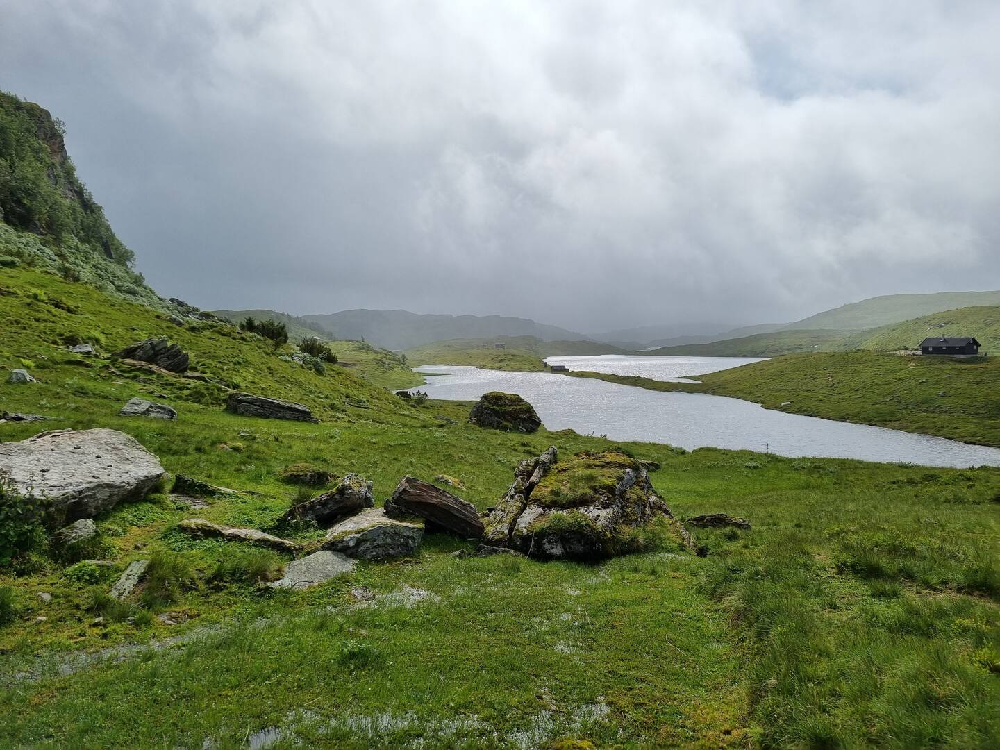
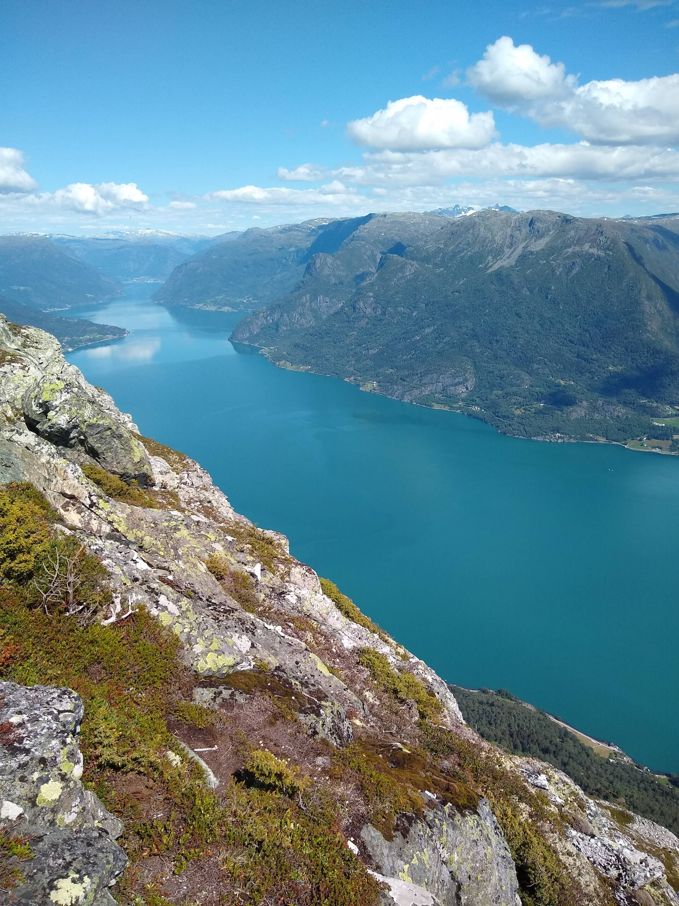
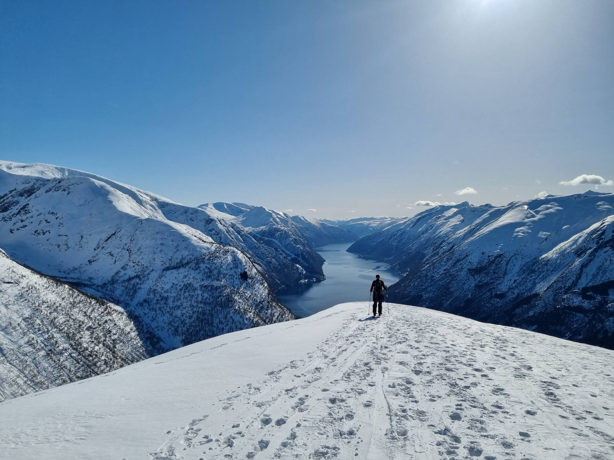

# Fjellturar nær Køyribu

Køyribu ligg godt til for sommarturar i Sogndalsfjella og området kring Fjærland. Her har vi samla turar som fungerer godt frå hytta, frå korte familieturar og fiskestopp til toppar med stor utsikt over fjord og fjell.

<a class="eyebrow-link" href="activities">Tilbake til aktivitetar</a>

  
<strong>Snøgg oversikt:</strong> Vel Fagreggi eller Anestølen for ein enkel dag ute, Gunvordalen når de vil halde det roleg og ope, og Togga, Molden eller Skredfjellet når målet er utsikt og ein meir tydeleg topptur.

<ul class="section-anchor-list">
  <li><a href="#nare">Nær hytta</a></li>
  <li><a href="#familieturar">Familieturar</a></li>
  <li><a href="#toppturar">Toppturar</a></li>
  <li><a href="#tur-tips">Før de går</a></li>
</ul>

  

    
  

  

    
  

  

    
  

---

<h2 id="nare">Nær hytta</h2>

  

    

      <h3>Fagreggi</h3>
      
Ein enkel tur opp mot tregrensa med fleire små vatn undervegs. Dette er eit svært godt val om de vil gå rett frå nærområdet og kombinere tur med fiske, pause og utsikt.

      <ul class="meta-list">
        <li><strong>Avstand:</strong> Kan gåast direkte frå hytta eller frå Hodlekve.</li>
        <li><strong>Tidsbruk:</strong> Om lag 1 time opp, med moglegheit for å forlenge turen vidare.</li>
        <li><strong>Vanskegrad:</strong> Lett.</li>
        <li><strong>Fiske:</strong> Mange små vatn med aure. Fiskekort kan kjøpast med Vipps `699351`. Born under 16 år fiskar gratis.</li>
        <li><strong>Lenkjer:</strong> <a href="https://www.norgeskart.no/#!?project=norgeskart&layers=1001&zoom=13&lat=6819263.65&lon=69324.80&sok=fagreggi&markerLat=6819267.220029058&markerLon=69071.47161072219&p=searchOptionsPanel">Kart i Norgeskart</a> og <a href="https://www.visitnorway.no/listings/g%C3%A5tur-til-fagreggi/261753">turinfo hos Visit Norway</a>.</li>
      </ul>
    

    

      
    

  

  

    

      <h3>Gunvordalen</h3>
      
Når de heller vil ha ein lettare og flatare tur, er Gunvordalen eit fint val. Terrenget er rolegare enn på toppane rundt, og turen eignar seg godt når de vil gå utan å binde dykk til ein lang dag.

      <ul class="meta-list">
        <li><strong>Startpunkt:</strong> Same parkeringsplass som for Togga.</li>
        <li><strong>Tidsbruk:</strong> 1 til 3 timar tur-retur, alt etter kor langt de ønskjer å gå.</li>
        <li><strong>Vanskegrad:</strong> Lett.</li>
        <li><strong>Lenkje:</strong> <a href="https://peakbook.org/no/peakbook-element/63255/Tursti+Gunvordalen.html">Tursti i Gunvordalen på Peakbook</a>.</li>
      </ul>
    

    

      
    

  

---

<h2 id="familieturar">Familieturar og enkle stopp</h2>

  

    

      <h3>Anestølen</h3>
      
Ein familievenleg stølstur med roleg dalføre, geiter i beiteområdet og moglegheit for både fiske og bading. Dette er ein av dei mest fleksible turane i området, særleg for familiar eller dagar med skiftande energi.

      <ul class="meta-list">
        <li><strong>Køyreavstand:</strong> Om lag 10 minutt frå hytta via bomveg frå Hodlekve.</li>
        <li><strong>Tidsbruk:</strong> 1 til 2 timar tur-retur om de går grusvegen, eller kortare stopp dersom de køyrer inn.</li>
        <li><strong>Vanskegrad:</strong> Lett.</li>
        <li><strong>Ekstra:</strong> Fint for fiske, bading og møte med dyr på beite. Bomveg kostar om lag NOK 50 per bil.</li>
        <li><strong>Lenkjer:</strong> <a href="https://www.fjordnorway.com/no/se-og-gjore/sykkeltur-til-anestolen">Anestølen hos Fjord Norway</a> og <a href="https://www.visitnorway.no/listings/guida-st%C3%B8lsbes%C3%B8k-anest%C3%B8len-sogndal/245705/">guiding og stølsbesøk</a>.</li>
      </ul>
    

    

      
    

  

---

<h2 id="toppturar">Toppturar med utsikt</h2>

  

    

      <h3>Togga</h3>
      
Ein populær topp nær hytta med brei utsikt når de kjem opp. Stigninga er bratt gjennom skogen, så denne turen passar best på tørre dagar når de ønskjer ei meir krevjande økt.

      <ul class="meta-list">
        <li><strong>Køyreavstand:</strong> 5 til 10 minutt til start ved Nystølen.</li>
        <li><strong>Tidsbruk:</strong> 3 til 4 timar tur-retur.</li>
        <li><strong>Vanskegrad:</strong> Krevjande.</li>
        <li><strong>Merk:</strong> Kan vere glatt og sleipt i skoggrensa når det er vått.</li>
        <li><strong>Lenkjer:</strong> <a href="https://ut.no/turforslag/116454">Turbeskriving på UT.no</a> og <a href="https://www.fjellvenner.no/fjellturer-i-andre-fjellomraader/togga-1205-moh">bilete og inspirasjon</a>.</li>
      </ul>
    

    

      
    

  

  

    

      <h3>Molden</h3>
      
Ein klassikar i området med storslått utsikt over Lustrafjorden. Turen passar godt som dagstur frå hytta når de vil kombinere ein moderat topptur med ein av dei mest kjende fjordutsiktene i regionen.

      <ul class="meta-list">
        <li><strong>Køyreavstand:</strong> Om lag 30 minutt til start ved Krossen.</li>
        <li><strong>Tidsbruk:</strong> 2 til 3 timar tur-retur.</li>
        <li><strong>Vanskegrad:</strong> Middels.</li>
        <li><strong>Lenkje:</strong> <a href="https://ut.no/turforslag/118573/topptur-til-molden-fra-krossen">Topptur til Molden på UT.no</a>.</li>
      </ul>
    

    

      
    

  

  

    

      <h3>Skredfjellet</h3>
      
Ein flott tur i retning Fjærland når de vil ha både fjord og fjell i same oppleving. Starten ved Berge gjer dette til ein fin dagstur frå hytta med litt meir reise, men stor belønning på toppen.

      <ul class="meta-list">
        <li><strong>Køyreavstand:</strong> Om lag 20 minutt frå hytta.</li>
        <li><strong>Tidsbruk:</strong> 3 til 4 timar tur-retur.</li>
        <li><strong>Vanskegrad:</strong> Middels.</li>
        <li><strong>Lenkje:</strong> <a href="https://www.visitnorway.no/listings/fjell-og-fjord-vandring-til-skredfjellet-i-fj%C3%A6rland/246118/">Turbeskriving hos Visit Norway</a>.</li>
      </ul>
    

    

      
    

  

---

<h2 id="tur-tips">Tips før de går</h2>

  

    <h3>Planlegg etter vêr</h3>
    
Sjekk vêrmelding før de går, særleg for Togga og Skredfjellet. Bratte parti blir raskt mindre trivelege når det er vått.

  

  

    <h3>Ta med litt ekstra</h3>
    
Drikke, ekstra klede og gode sko gjer mykje. Nokre parti er steinete, og vêret skiftar fort i fjellet.

  

  

    <h3>Kart og fiskekort</h3>
    
Bruk gjerne <a href="https://ut.no/">UT.no</a> og <a href="https://www.norgeskart.no/">Norgeskart</a> for turplanlegging. Fiskekort finn de hos <a href="https://www.sogndalskisenter.no/fiske">Sogndal Skisenter</a>.

  

God tur frå oss på Køyribu. Om de ønskjer fleire lokale tips, deler vi gjerne forslag som passar ver, form og kven som er med på turen.
