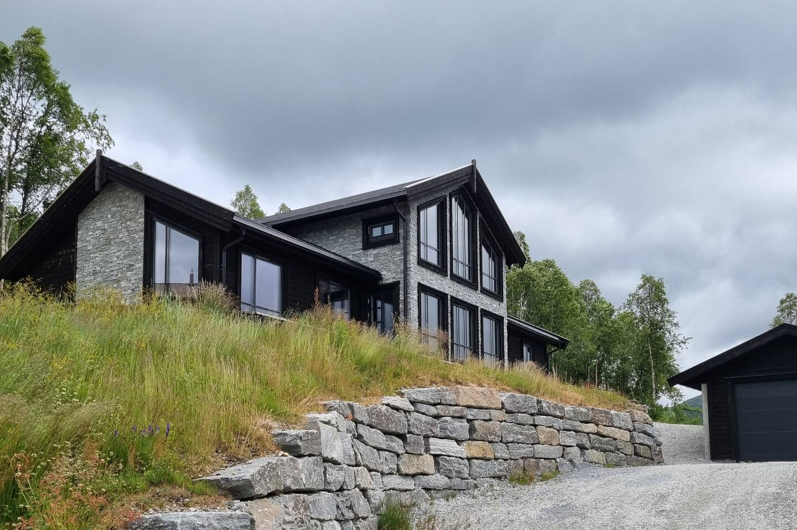
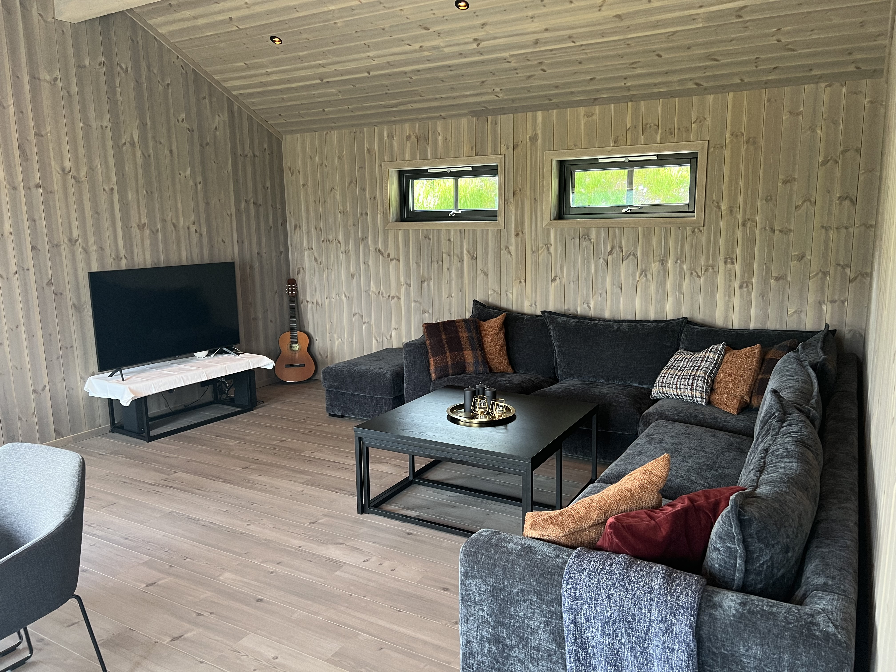

# Velkomen til Køyribu

Køyribu er ei romsleg familiehytte over Sogndal, omgitt av fjell, rolege sommarlandskap og enkel tilgang til turar, badeplassar og dagsturar. Her er det lett å finne roen, vere saman og nyte lange kveldar etter ein dag ute.

👉 [Sjekk tilgjenge og book på Airbnb](https://www.airbnb.no/rooms/902164708584277005)

---

## Sommaren på hytta

Køyribu passar spesielt godt som sommarbase for familiar, par og små grupper som ønskjer både komfort og natur tett på.

- Fredeleg fjellplassering over Sogndal
- 4 soverom og 2 bad
- Fullt utstyrt kjøkken, wifi, sengetøy og handkle
- Kort veg til fjellturar, fiske og bading

Vil du sjå meir om sjølve hytta, finn du det på sida [Hytta](cabin).

---

## Meir enn berre ein stad å sove

Hytta er laga for gode dagar saman. Her er det plass til å lage mat, kvile, jobbe i fred og kome tilbake frå tur til ein lun og komfortabel base. Området kjennest skjerma og roleg, samstundes som det gir rask tilgang til nokre av dei finaste sommaropplevingane i regionen.

  
  
  

---

## Kva kan du gjere her?

- Gå rett ut i nærliggande fjellterreng
- Nyte varme dagar ved vatn, elv eller fjord
- Fiske i fjellvatn rundt Sogndal og Hodlekve
- Bruke hytta som base for dagsturar i Sogndals- og Fjærlandsområdet

Start med [Fjellturar](hikes). Fleire aktivitetstips kjem etter kvart.

---

## Allereie bestilt?

Dersom du planlegg opphaldet og treng praktiske detaljar, finn du det her:

- [Gjesteinfo](guest-info) for tilgang, husreglar, kjøkkeninformasjon og avreise
- [Hytta](cabin) for ei tydelegare oversikt over rom, stemning og fasilitetar

---

## Om vertskapet

Køyribu er familiehytta vår, og vi ønskjer at gjestene skal kjenne seg både velkomne og godt førebudde. Utanfor den viktigaste sommarutleigeperioden brukar vi hytta mykje sjølve, noko som gjer at ho held seg personleg, praktisk og godt teken vare på.

---

© 2026 Køyribu koyribu.no  
Publisert via GitHub Pages
